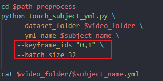

## flame
### 环境创建
```
conda env create -f environment.yml
```
### data 结构
将某段视频帧放置在其对应的文件夹（可以用视频中人的编号或名称命名）下，对应下面的subject目录，subject目录的父目录则对应数据的根目录。
```
-- data_root
    -- subject
        -- video.mp4
```
### bash 脚本修改
视频数据按照上述方式进行放置之后，需要修改fitting_flame.sh脚本。示例如下图所示，将脚本中的subject_name修改为data结构中的subject目录名称，将path修改为数据根目录路径。


```bash
subject_name=$subject
path=/path/to/your/data_root
```
### 对视频进行 fitting
```shell
bash fitting_flame.sh
```
基本流程：
- 使用 ffmpeg 提取视频帧，帧率设定为 25fps，可自行修改。
- 输入一帧图像（最好是中性表情的图像），使用 MICA 获得人脸的 shape（输出 identity.npy 文件）。


- 生成 tracker 需要的 .yml 配置文件。
    - 选择中性表情的关键帧，修改`keyframe_ids`，多张关键帧编号使用逗号`,`隔开。
    - 设置 `batch_size`，合理利用显存。



- 使用 metrical-tracker 拟合视频帧的exp和pose参数。重点关注`initialize_tracking()`和`optimize_video()`两部分。
    - `initialize_tracking()`：使用关键帧优化shape参数，并初步优化相机位姿；
    - `optimize_video()`：拟合每帧的exp和pose。

输出：
- 每帧的exp和pose参数：subject目录下的**checkpoint**文件夹下的 *.frame 文件。
- 用于配准的图像：subject目录下的**input**文件夹下的 *.png 文件。
- shape参数：subject目录下的 **shape_param.shape** 文件。

### 渲染
利用上述的输出文件，使用 NVdiffrast 进行渲染。`--frame_id_gen_tex` 对应生成纹理的图像编号，请选择中性表情的关键帧进行纹理的生成。
```shell
python render_mesh_disk.py --data_path /path/to/your/data_root/$subject --frame_id_gen_tex 0
```
输出：
- 纹理图像：`/path/to/your/data_root/$subject/texture.png`
- 渲染视频：`/path/to/your/data_root/$subject/merged_meshes.avi`

### TODO
- [ ] 关键帧的自动化选取